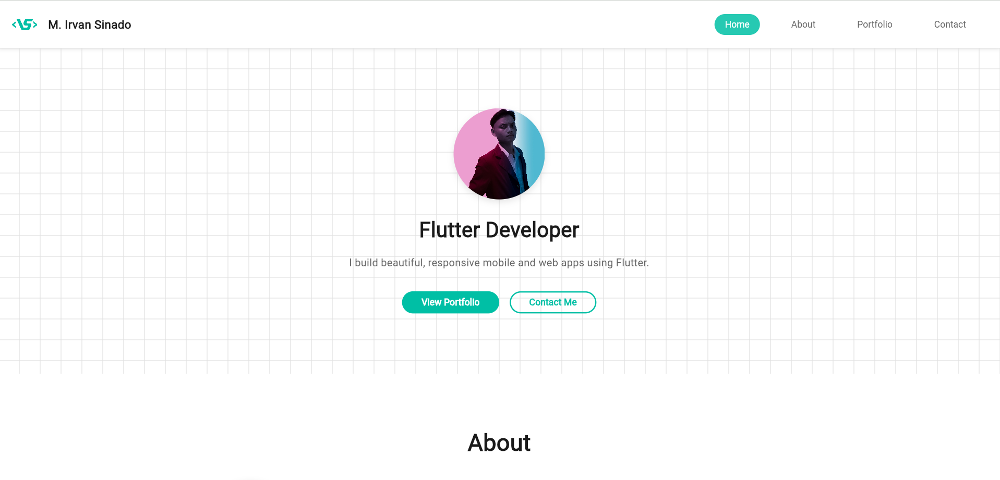
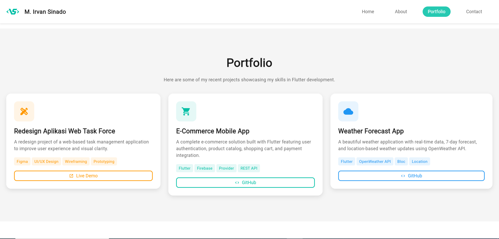
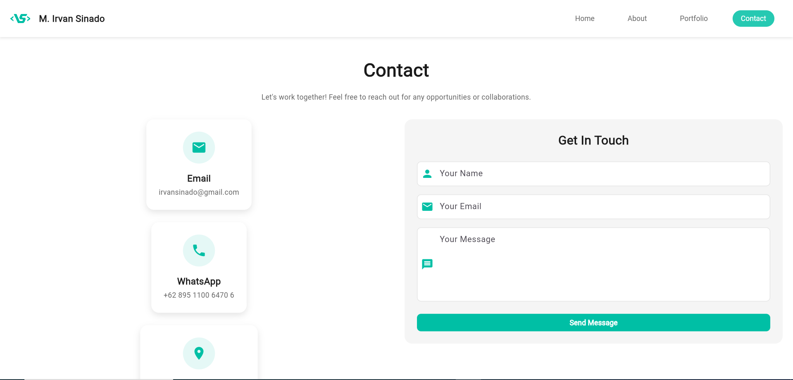

# My Portfolio (Flutter)

Portofolio pribadi berbasis **Flutter** yang menampilkan profil, keahlian, proyek, dan kontak. Aplikasi ini dirancang responsif untuk **web** dan **mobile**, dengan performa ringan dan navigasi yang intuitif.

---

## Daftar Isi

* [Fitur Utama](#fitur-utama)
* [Demo & Tangkapan Layar](#demo--tangkapan-layar)
* [Teknologi & Paket](#teknologi--paket)
* [Struktur Proyek](#struktur-proyek)
* [Konfigurasi Konten & Aset](#konfigurasi-konten--aset)
* [Menjalankan Secara Lokal](#menjalankan-secara-lokal)
* [Build & Deploy](#build--deploy)
* [Form Kontak: Backend](#form-kontak-backend)
* [Kualitas Kode](#kualitas-kode)
* [Roadmap](#roadmap)
* [Lisensi](#lisensi)
* [Kontak](#kontak)

---

## Fitur Utama

* **Responsif** untuk desktop, tablet, dan ponsel.
* Section: **Home**, **About**, **Portfolio/Projects**, **Contact**, **Footer**.
* **Custom grid background** via `CustomPainter` untuk nuansa techy yang halus.
* **Komponen reusable** (Card, SkillChip, ContactCard, dsb) agar konsisten dan hemat duplikasi.
* **Design system**: warna, spacing, radius, font size, durasi animasi, disentralisasi di `AppConstants`.
* **Form kontak** terhubung ke backend sederhana via `HTTP POST`.

---

## Demo & Tangkapan Layar

Tambahkan tangkapan layar ke folder `screenshots/`, lalu perbarui tautan di bawah.

| Home                          | Projects                              | Contact                             |
| ----------------------------- | ------------------------------------- | ----------------------------------- |
|  |  |  |

> Ganti path gambar sesuai kebutuhan.

---

## Teknologi & Paket

* **Flutter** 3.x • **Dart** 3.x
* Paket yang digunakan di kode:

  * `url_launcher` untuk membuka tautan eksternal
  * `http` untuk form kontak (request ke backend)
  * `font_awesome_flutter` untuk ikon

Tambahkan di `pubspec.yaml` (sesuaikan versi dengan proyekmu):

```yaml
dependencies:
  flutter:
    sdk: flutter
  url_launcher: ^6.3.0
  http: ^1.2.0
  font_awesome_flutter: ^10.7.0
```

---

## Struktur Proyek

Struktur inti sesuai folder `lib/`:

```
lib/
├─ main.dart
├─ models/
│  └─ project_model.dart
├─ painters/
│  └─ grid_background_painter.dart
├─ screens/
│  ├─ project_detail_page.dart
│  └─ welcome_screen.dart
├─ sections/
│  ├─ about_section.dart
│  ├─ contact_section.dart
│  ├─ footer_section.dart
│  ├─ home_section.dart
│  ├─ optimized_sections.dart
│  └─ portfolio_section.dart
├─ utils/
│  └─ app_constants.dart
└─ widgets/
   ├─ contact_card.dart
   ├─ contact_form.dart
   ├─ custom_app_bar.dart
   ├─ info_item.dart
   ├─ project_card.dart
   ├─ service_item.dart
   └─ skill_chip.dart
```

**Highlight:**

* `utils/app_constants.dart` berisi **AppColors**, **AppSizes**, **AppStrings**, **AppAssets**, **AppDurations**, **AppCurves** untuk konsistensi UI/UX.
* `painters/grid_background_painter.dart` menggambar grid background ringan.
* `widgets/` berisi komponen reusable (card, chip, form, dsb).
* `sections/` memecah halaman menjadi bagian-bagian jelas dan mudah dirawat.
* `widgets/contact_form.dart` melakukan `POST` ke endpoint backend `/send_email`.

---

## Konfigurasi Konten & Aset

### 1) Personalisasi teks

Ubah identitas dan teks tampilan di `utils/app_constants.dart` bagian **AppStrings**:

```dart
class AppStrings {
  static const String fullName = 'M. Irvan Sinado';
  static const String profession = 'Flutter Developer';
  static const String location = 'Bandar Lampung, Indonesia';
  static const String email = 'irvansinado@gmail.com';
  // ... dst.
}
```

### 2) Aset gambar

`AppAssets` di `app_constants.dart` mereferensikan aset seperti logo dan foto profil:

```dart
class AppAssets {
  static const String logo = 'assets/images/LogoVansyCoding.png';
  static const String profileImage = 'assets/images/pasFoto.jpg';
  // ... dst.
}
```

Daftarkan di `pubspec.yaml`:

```yaml
flutter:
  assets:
    - assets/images/
    - assets/images/projects/
```

Pastikan file-file tersebut ada di path yang sama dengan referensinya.

---

## Menjalankan Secara Lokal

**1) Siapkan environment**

```bash
flutter doctor
flutter pub get
```

**2) Aktifkan target web (opsional)**

```bash
flutter config --enable-web
```

**3) Jalankan**

* Web:

```bash
flutter run -d chrome
```

* Android:

```bash
flutter devices
flutter run -d <device_id>
```

* iOS (butuh macOS + Xcode):

```bash
flutter run -d ios
```

---

## Build & Deploy

### Web (GitHub Pages)

Jika repositori dipublikasikan di `https://<username>.github.io/myPortfolio`:

```bash
flutter build web --release --base-href "/myPortfolio/"
```

Deploy ke branch `gh-pages`:

```bash
# dari root proyek
git worktree add gh-pages gh-pages
rm -rf gh-pages/*

cp -r build/web/* gh-pages/
cd gh-pages
git add -A
git commit -m "deploy: update portfolio"
git push origin gh-pages
```

Aktifkan di GitHub: **Settings → Pages → Deploy from a branch → Branch: gh-pages (root).**

### Android

```bash
flutter build apk --release
# output: build/app/outputs/flutter-apk/app-release.apk
```

### iOS

```bash
flutter build ios --release
# selesaikan signing di Xcode jika diperlukan
```

---

## Form Kontak: Backend

Komponen `ContactForm` mengirim `POST` JSON ke:

* `http://localhost:5000/send_email` (web/desktop)
* `http://192.168.112.38:5000/send_email` (emulator; sesuaikan IP LAN)

**Pastikan backend aktif**, menerima payload:

```json
{ "name": "Nama", "email": "Email", "message": "Pesan" }
```

### Contoh backend Node.js (Express)

```js
// server.js
import express from "express";
import cors from "cors";
import bodyParser from "body-parser";

const app = express();
app.use(cors());
app.use(bodyParser.json());

app.post("/send_email", async (req, res) => {
  const { name, email, message } = req.body;
  // TODO: kirim email via layanan pilihanmu (Nodemailer/Resend/SendGrid)
  console.log("New message:", { name, email, message });
  return res.status(200).json({ ok: true });
});

app.listen(5000, () => console.log("API running on http://localhost:5000"));
```

### Contoh backend Python (Flask)

```py
from flask import Flask, request, jsonify
from flask_cors import CORS

app = Flask(__name__)
CORS(app)

@app.post("/send_email")
def send_email():
  data = request.get_json()
  # TODO: kirim email menggunakan SMTP/layanan pihak ketiga
  print("New message:", data)
  return jsonify(ok=True), 200

app.run(host="0.0.0.0", port=5000)
```

> Catatan: untuk target **web**, aktifkan **CORS** di backend. Jika deploy di produksi, gunakan domain yang aman dan HTTPS.

---

## Kualitas Kode

Format, lint, dan test:

```bash
dart format .
flutter analyze
flutter test
```

Rekomendasi:

* Tambahkan `analysis_options.yaml` untuk aturan lint konsisten.
* Gunakan `squash merge` saat menerima PR agar riwayat commit tetap bersih.

---

## Roadmap

* [ ] Mode gelap/terang toggle
* [ ] Multi-bahasa (i18n)
* [ ] Animasi transisi tambahan dan micro-interactions
* [ ] Blog/Artikel terintegrasi
* [ ] Halaman studi kasus detail per proyek

---

## Lisensi

Rilis dengan lisensi **MIT**. Lihat berkas `LICENSE` untuk detail.

---

## Kontak

* **Nama**: M. Irvan Sinado
* **Email**: [irvansinado@gmail.com](mailto:irvansinado@gmail.com)
* **Lokasi**: Bandar Lampung, Indonesia
* **Portfolio Repo**: `myPortfolio`
